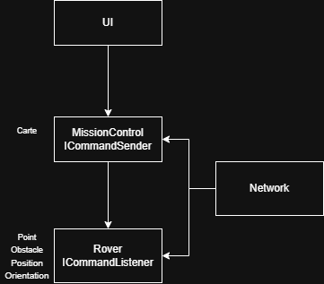

# Objectif-Mars

## Sommaire

-   [Cahier des charges](#cahier-des-charges)
    -   [Contraintes](#contraintes)
    -   [Exigences non-fonctionnelles](#exigences-non-fonctionnelles)
    -   [Exigences fonctionnelles](#exigences-fonctionnelles)

## Cahier des charges

### Contraintes

-   Le projet doit inclure une série de tests afin de garantir le bon fonctionnement des deux parties.
-   Le projet utilise le langage de programmation Python, pour sa simplicité de lecteur et donc de maintenabilité. La partie sécurité est aussi plus facile à aborder qu'avec d'autres langages.
-   Le projet doit inclure un simulateur de Rover et un générateur de planète afin de pouvoir réaliser des tests de communications et de performances.
-   Le projet doit être documenté, notamment sur la partie mise en communication et contrôles du MissionControl.
-   Le projet doit être adapté au développement sur toute plateforme et n'est donc pas restreint à des OS et IDE spécifiques.

### Exigences non-fonctionnelles

-   Le système doit utiliser un protocole de communication WebSocket pour la transmission des données.
    => Connexion qui reste ouverte, évite donc de répéter les opérations d'authentification. Permet de restreindre le nombre de connexions simultanées.
-   Le système doit être capable de gérer des communications réseau avec des latences élevées.
-   Le système doit être robuste et capable de gérer les erreurs de communication réseau.
-   Le système doit être capable de traiter les erreurs.

### Exigences fonctionnelles

-   Le Rover doit pouvoir traiter une suite de commandes de manière autonome.
-   Le Rover doit pouvoir avancer d'une unité dans la direction de son orientation actuelle.
-   Le Rover doit pouvoir reculer d'une unité dans la direction opposée à son orientation actuelle.
-   Le Rover doit pouvoir tourner de 90° à gauche.
-   Le Rover doit pouvoir tourner de 90° à droite.
-   Le Rover doit pouvoir signaler la rencontre d'un obstacle et s'arrêter.
-   Le Rover doit renvoyer son état (position et orientation) après chaque commande.

-   Le MissionControl doit pouvoir envoyer une suite de commandes au Rover.
-   Le MissionControl doit pouvoir recevoir et afficher la position et l'orientation du Rover après chaque commande.
-   Le MissionControl est une console contrôlable au clavier.

-   On ne connaît pas le terrain, seulement la taille de la planète.
-   La carte doit se rafraîchir après chaque commande.

### Schéma de l'architecture de l'application

